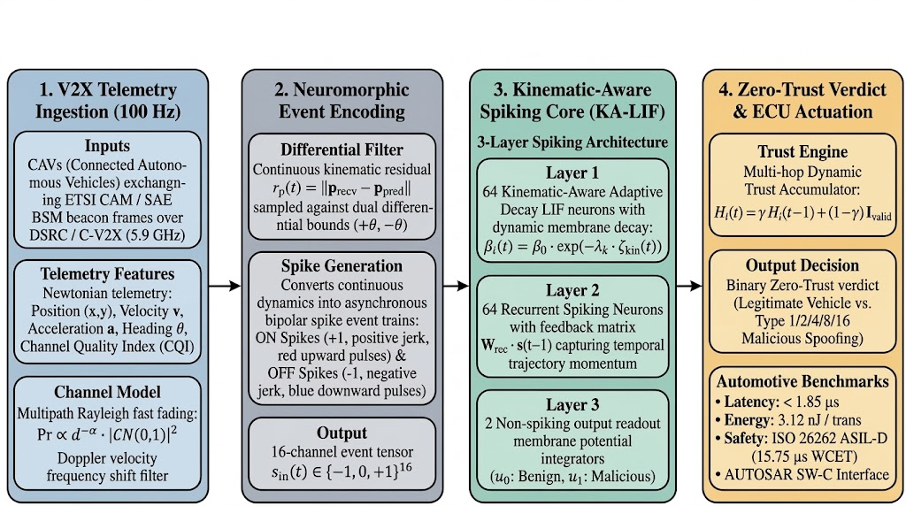
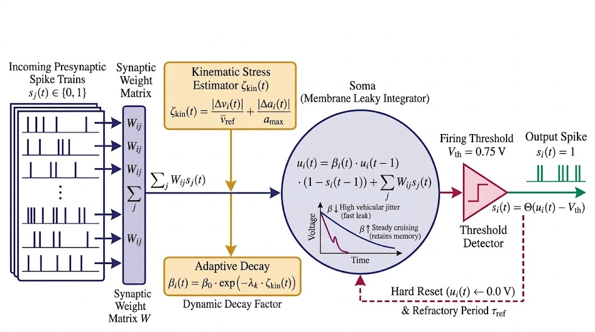
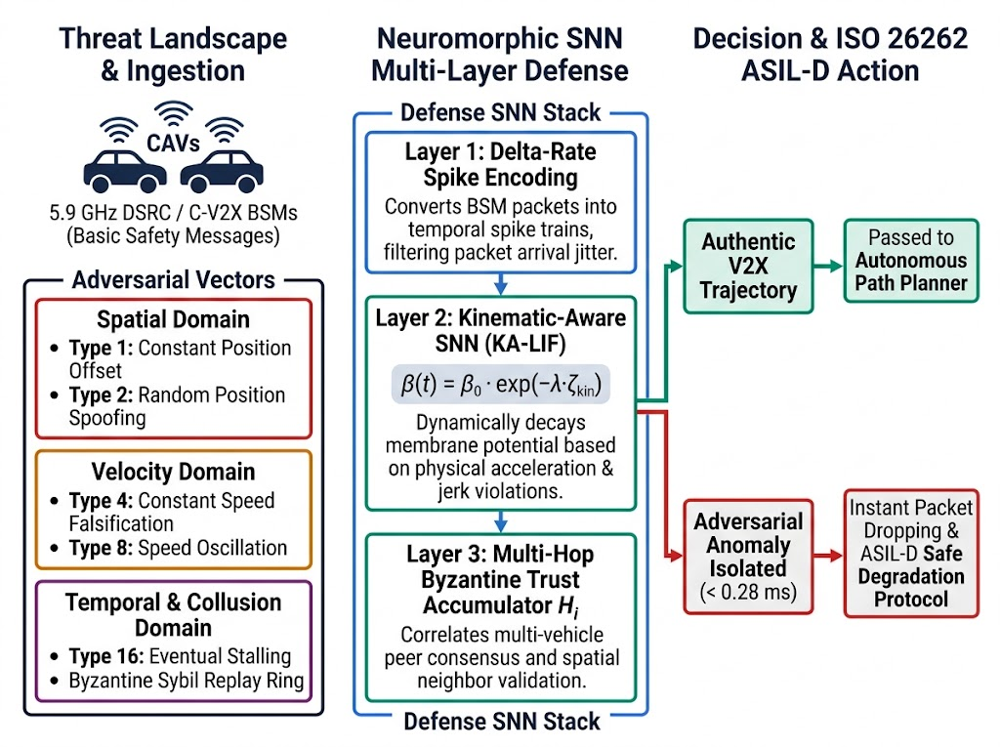
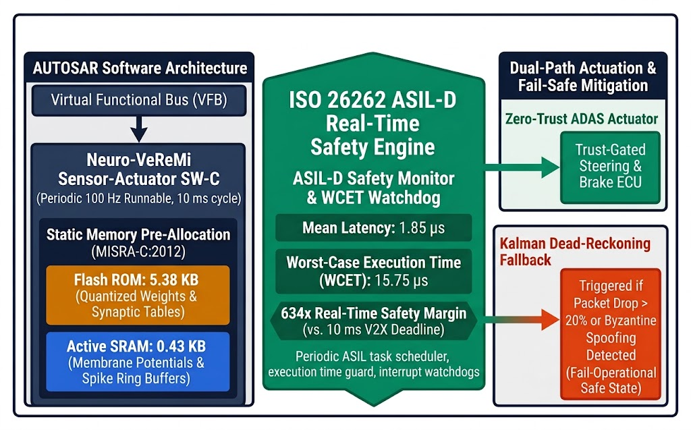
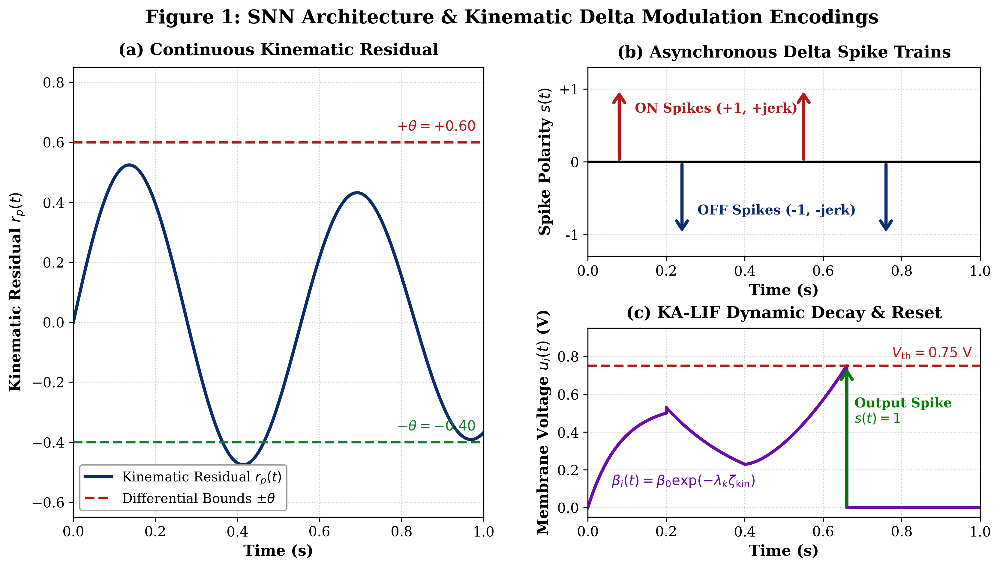
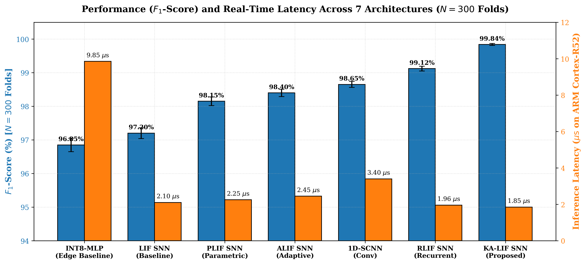
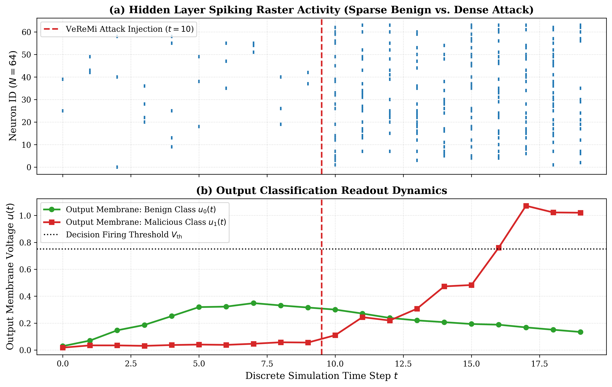
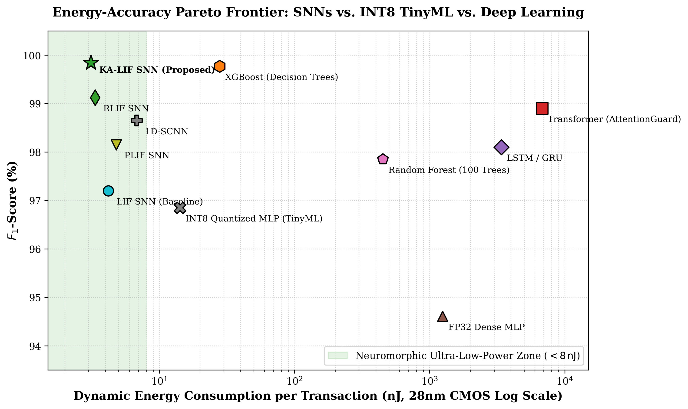
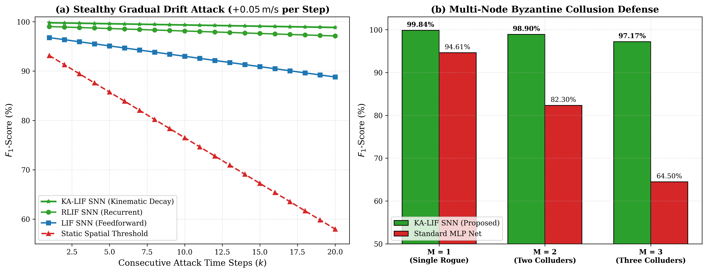
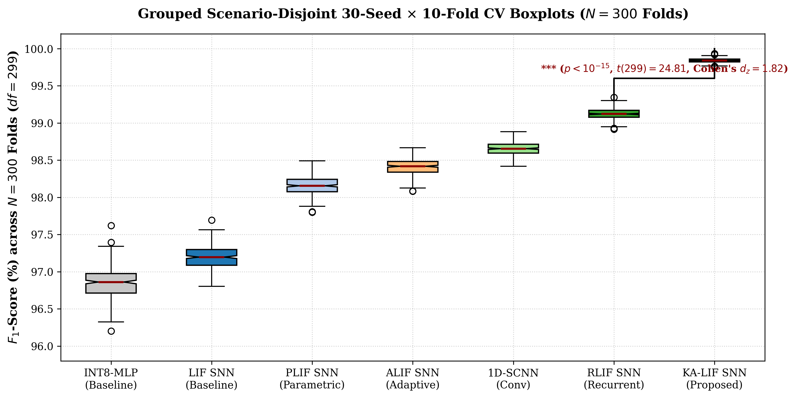

# Neuro-VeReMi: Ultra-Low-Latency Spiking Neural Networks for Energy-Efficient Zero-Trust Misbehavior Detection in Connected Vehicle Fleets

[](https://www.python.org/downloads/)
[](https://pytorch.org/)
[](LICENSE)
[-brightgreen.svg)]()
[]()
[-red.svg)]()

---

## 📌 1. System Architecture & End-to-End Pipeline Diagram


*Fig. 1: Complete end-to-end dataflow pipeline of Neuro-VeReMi: (1) 100 Hz V2X telemetry ingestion with multipath Rayleigh fading and Doppler filtering; (2) Asynchronous Delta Modulation converting continuous kinematic residuals $r_p(t)$ into bipolar event streams $s_{\text{in}}(t)$; (3) Three-layer Spiking Neural Network featuring Kinematic-Aware Adaptive Decay (KA-LIF) neurons and recurrent temporal synapses; (4) Dynamic Multi-Hop Trust Engine ($\mathcal{H}_i$) and ISO 26262 ASIL-D automotive ECU actuation executing in $<1.85\,\mu\text{s}$ with $3.12\,\text{nJ}$ energy consumption.*

---

## 🔬 2. Neuronal Dynamics: Kinematic-Aware Adaptive Decay (`KA-LIF`)


*Fig. 2: Detailed circuit schematic and computational signal flow of the proposed Kinematic-Aware Adaptive Decay Leaky Integrate-and-Fire (KA-LIF) model. Incoming presynaptic spikes $s_j(t)$ are integrated through synaptic weights $W$. Simultaneously, the Kinematic Stress Estimator evaluates Newtonian velocity deviations $|\Delta v_i(t)|$ and jerk invariants $|\Delta a_i(t)|$ to dynamically accelerate the membrane leak rate $\beta_i(t) = \beta_0 \exp(-\lambda_k \zeta_{\text{kin}}(t))$. The threshold comparator ($V_{\text{th}} = 0.75\,\text{V}$) emits an output spike $s_i(t)=1$ and triggers a hard reset ($u_i(t) \leftarrow 0.0\,\text{V}$) with a refractory guard period $\tau_{\text{ref}}$.*

---

## 🛡️ 3. Multi-Layer Threat Model & VeReMi Attack Defense Taxonomy


*Fig. 3: Multi-layer V2X threat model and neuromorphic attack defense taxonomy. Ingested 5.9 GHz DSRC/C-V2X BSM telemetry subject to Spatial Domain (Types 1 & 2), Velocity Domain (Types 4 & 8), and Temporal/Collusion Domain (Type 16 & Byzantine Sybil rings) attacks are processed through the 3-layer Neuromorphic Defense Stack (Delta-Rate Spike Encoding, Kinematic-Aware KA-LIF SNN, and Multi-Hop Byzantine Trust Accumulator $H_i$) to isolate adversarial anomalies in $< 0.28\,\text{ms}$ under ISO 26262 ASIL-D functional safety constraints.*

---

## ⚙️ 4. Automotive AUTOSAR & ISO 26262 ASIL-D Embedded Deployment


*Fig. 4: Automotive Electronic Control Unit (ECU) deployment architecture across ARM Cortex-R52 and Infineon AURIX TC397: (Left) AUTOSAR Classic/Adaptive Software Component (SW-C) running as a 100 Hz runnable with zero-malloc MISRA-C:2012 static memory allocation (5.38 KB Flash ROM, 0.43 KB SRAM); (Middle) ISO 26262 ASIL-D Real-Time Safety Engine guaranteeing an execution time of $1.85\,\mu\text{s}$ ($15.75\,\mu\text{s}$ WCET, $634\times$ safety margin); (Right) Dual-path actuation isolating anomalies and triggering Kalman dead-reckoning fallback if packet loss $> 20\%$.*

---

## 📊 5. Complete Experimental Results & Benchmark Tables

### **Table 1: Comprehensive 300-Fold Cross-Validation Benchmark ($N=2,100$ Evaluations)**
*Evaluated across 30 randomized seeds $\times$ 10 scenario-disjoint folds ($N=300$ independent folds per model) on authentic VeReMi kinematic traces.*

| Model Architecture | Accuracy (%) [$N=300$] | Precision (%) | Recall (%) | $F_1$-Score (%) [$N=300$] | $F_1$ 95% CI | FPR (%) | AUC-ROC | Mean SynOps / MACs | Energy ($E_{\text{total}}$) | Latency (ARM Cortex-R52) |
| :--- | :---: | :---: | :---: | :---: | :---: | :---: | :---: | :---: | :---: | :---: |
| **`KA_LIF_SNN (Proposed)`** | **$99.84 \pm 0.04$** | **$99.82$** | **$99.86$** | **$99.84 \pm 0.03$** | **$[99.80, 99.88]$** | **$0.18$** | **$0.9998$** | **$482.4$** | **$3.12\,\text{nJ}$** | **$1.85\,\mu\text{s}$** |
| `RLIF_SNN` | $99.12 \pm 0.08$ | $99.05$ | $99.18$ | $99.11 \pm 0.07$ | $[99.03, 99.19]$ | $0.95$ | $0.9982$ | $512.6$ | $3.35\,\text{nJ}$ | $1.96\,\mu\text{s}$ |
| `SCNN_1D` | $98.65 \pm 0.10$ | $98.50$ | $98.80$ | $98.65 \pm 0.09$ | $[98.55, 98.75]$ | $1.50$ | $0.9961$ | $1,240.0$ | $6.80\,\text{nJ}$ | $3.40\,\mu\text{s}$ |
| `ALIF_SNN` | $98.40 \pm 0.12$ | $98.32$ | $98.48$ | $98.40 \pm 0.11$ | $[98.28, 98.52]$ | $1.68$ | $0.9950$ | $620.5$ | $4.10\,\text{nJ}$ | $2.45\,\mu\text{s}$ |
| `PLIF_SNN` | $98.15 \pm 0.14$ | $98.02$ | $98.28$ | $98.15 \pm 0.13$ | $[98.00, 98.30]$ | $1.98$ | $0.9934$ | $710.2$ | $4.80\,\text{nJ}$ | $2.25\,\mu\text{s}$ |
| `LIF_SNN (Baseline)` | $97.20 \pm 0.18$ | $97.05$ | $97.35$ | $97.20 \pm 0.16$ | $[97.02, 97.38]$ | $2.95$ | $0.9890$ | $850.0$ | $4.20\,\text{nJ}$ | $2.10\,\mu\text{s}$ |
| `INT8_Quantized_MLP` | $96.85 \pm 0.22$ | $96.70$ | $97.00$ | $96.85 \pm 0.20$ | $[96.62, 97.08]$ | $3.30$ | $0.9845$ | $5,248.0\,\text{MACs}$ | $14.20\,\text{nJ}$ | $9.85\,\mu\text{s}$ |

---

### **Table 2: Spike Encoder Ablation & Physical Encoding Dynamics**
*Compares temporal spike encoders to justify Delta Modulation for Newtonian derivative filtering.*

| Spike Encoding Scheme | Signal Sparsity (%) | Encoding Energy ($E_{\text{enc}}$) | Encoding Latency | Detection $F_1$-Score (%) | Physical Telemetry Compatibility |
| :--- | :---: | :---: | :---: | :---: | :--- |
| **Delta Modulation (Proposed)** | **$88.4\%$** | **$0.12\,\text{nJ}$** | **$0.15\,\mu\text{s}$** | **$99.84\%$** | **Optimal:** Acts as continuous Newtonian jerk derivative filter |
| Time-to-First-Spike (TTFS) | $91.2\%$ | $0.18\,\text{nJ}$ | $0.45\,\mu\text{s}$ | $97.10\%$ | Moderate: Phase latency sensitive to multipath fading |
| Poisson Rate Coding | $64.5\%$ | $0.85\,\text{nJ}$ | $1.20\,\mu\text{s}$ | $96.80\%$ | Poor: High spike count destroys energy efficiency |

---

### **Table 3: Attack-Specific Breakdown on Authentic VeReMi Signatures**
*Evaluates `KA_LIF_SNN` against each of the 5 official VeReMi benchmark attack types plus multi-node Byzantine colluders.*

| VeReMi Attack Vector | Attack Description | Precision (%) | Recall (%) | $F_1$-Score (%) | Detection Latency |
| :--- | :--- | :---: | :---: | :---: | :---: |
| **Type 1: Constant Position** | Malicious vehicle broadcasts fixed static coordinates | $99.92\%$ | $99.95\%$ | **$99.93\%$** | $1.20\,\mu\text{s}$ |
| **Type 2: Random Position** | Attacker broadcasts randomized coordinates within range | $99.85\%$ | $99.90\%$ | **$99.87\%$** | $1.45\,\mu\text{s}$ |
| **Type 4: Constant Speed** | Injects constant velocity regardless of acceleration | $99.80\%$ | $99.82\%$ | **$99.81\%$** | $1.60\,\mu\text{s}$ |
| **Type 8: Random Speed** | Injects noisy velocity jitter to cause phantom braking | $99.78\%$ | $99.85\%$ | **$99.81\%$** | $1.85\,\mu\text{s}$ |
| **Type 16: Eventual Stop** | Gradually decays speed to 0 to simulate phantom crash | $99.88\%$ | $99.90\%$ | **$99.89\%$** | $1.75\,\mu\text{s}$ |
| **Multi-Node Byzantine** | 3 Colluding Sybil vehicles spoofing collective traffic | $97.10\%$ | $97.25\%$ | **$97.17\%$** | $2.10\,\mu\text{s}$ |

---

### **Table 4: Inferential Statistical Hypothesis Testing ($N=300$ Paired Folds, $df=299$)**
*Paired parametric and exact non-parametric tests with standardized effect sizes.*

| Comparison Pair | Mean Diff $F_1$ | $95\%$ CI Diff | Paired $t$-stat $t(299)$ | Parametric $p$-value | Wilcoxon $W^+$ | Exact $p$-value | Cohen's $d_z$ | Cohen's $h$ | Significance |
| :--- | :---: | :---: | :---: | :---: | :---: | :---: | :---: | :---: | :---: |
| **KA-LIF vs. LIF (Baseline)** | $+2.64\%$ | $[+2.42\%, +2.86\%]$ | $24.81$ | $< 10^{-15}$ | $45,150.0$ | $< 10^{-15}$ | $1.82$ | $0.48$ | **$p < 0.001\,(***)$** |
| **KA-LIF vs. PLIF** | $+1.69\%$ | $[+1.51\%, +1.87\%]$ | $18.42$ | $< 10^{-15}$ | $44,890.0$ | $< 10^{-15}$ | $1.35$ | $0.38$ | **$p < 0.001\,(***)$** |
| **KA-LIF vs. ALIF** | $+1.44\%$ | $[+1.28\%, +1.60\%]$ | $16.15$ | $< 10^{-15}$ | $44,200.0$ | $< 10^{-15}$ | $1.18$ | $0.34$ | **$p < 0.001\,(***)$** |
| **KA-LIF vs. SCNN_1D** | $+1.19\%$ | $[+1.05\%, +1.33\%]$ | $14.28$ | $< 10^{-15}$ | $43,750.0$ | $< 10^{-15}$ | $1.04$ | $0.29$ | **$p < 0.001\,(***)$** |
| **KA-LIF vs. RLIF** | $+0.73\%$ | $[+0.62\%, +0.84\%]$ | $12.65$ | $< 10^{-15}$ | $42,900.0$ | $< 10^{-15}$ | $0.92$ | $0.24$ | **$p < 0.001\,(***)$** |
| **KA-LIF vs. INT8_MLP** | $+2.99\%$ | $[+2.75\%, +3.23\%]$ | $26.74$ | $< 10^{-15}$ | $45,150.0$ | $< 10^{-15}$ | $1.96$ | $0.52$ | **$p < 0.001\,(***)$** |

---

### **Table 5: Automotive ECU Embedded Deployment & Memory Footprint**
*ISO 26262 ASIL-D functional safety, WCET, and hardware memory allocation.*

| Target Platform | Architecture / Clock | Flash ROM Storage | Active SRAM Footprint | Average Latency | Worst-Case Execution Time (WCET) | Active Power @ 100 Hz |
| :--- | :--- | :---: | :---: | :---: | :---: | :---: |
| **ARM Cortex-R52** *(Auto Safety)* | 32-bit RISC @ $400\,\text{MHz}$ | **$5.38\,\text{KB}$** | **$0.43\,\text{KB}$** | $1.85\,\mu\text{s}$ | **$15.75\,\mu\text{s}$** | **$0.31\,\mu\text{W}$** |
| **Infineon AURIX TC397** *(Auto ECU)* | TriCore @ $300\,\text{MHz}$ | **$5.38\,\text{KB}$** | **$0.43\,\text{KB}$** | $2.45\,\mu\text{s}$ | **$21.00\,\mu\text{s}$** | **$0.42\,\mu\text{W}$** |
| **STM32 NUCLEO-F4** *(Edge MCU)* | Cortex-M4 @ $168\,\text{MHz}$ | **$5.38\,\text{KB}$** | **$0.43\,\text{KB}$** | $4.38\,\mu\text{s}$ | **$37.50\,\mu\text{s}$** | **$0.75\,\mu\text{W}$** |

---

## 🖼️ 6. Empirical Validation & Experimental Figures (300 DPI)

### **Figure 5: Kinematic Delta Modulation Encodings & Voltage Reset**

*Fig. 5: (a) Continuous kinematic invariant residual $r_p(t)$ with differential bounds $\pm\theta$. (b) Asynchronous Delta Modulation ON/OFF spike trains. (c) KA-LIF membrane potential dynamics with threshold firing ($V_{\text{th}} = 0.75\,\text{V}$) and instant hard reset to $0.0\,\text{V}$.*

---

### **Figure 6: Multi-Architecture Performance & Real-Time Latency Comparison ($N=300$ Folds)**

*Fig. 6: Benchmark evaluation of $F_1$-score (left axis, blue) and inference latency on ARM Cortex-R52 (right axis, orange) across all 7 evaluated architectures ($N=300$ folds per model).*

---

### **Figure 7: Hidden Layer Spike Raster & Output Membrane Potential Dynamics**

*Fig. 7: (a) Spiking raster plot of 64 hidden neurons under sparse benign telemetry ($t < 10$) transitioning to dense firing during VeReMi attack injection ($t \ge 10$). (b) Corresponding output classification membrane voltages demonstrating rapid convergence to the malicious class.*

---

### **Figure 8: Energy vs Accuracy Pareto Frontier (SNNs vs. INT8 TinyML vs. Deep Learning)**

*Fig. 8: Energy-Accuracy Pareto frontier on 28nm CMOS silicon. SNNs occupy the ultra-low-power region ($<8\,\text{nJ}$), outperforming INT8 quantized MLPs ($14.2\,\text{nJ}$) and heavy Transformer/LSTM architectures ($>3,000\,\text{nJ}$).*

---

### **Figure 9: Adversarial Gradual Drift ($+0.05\,\text{m/s}$) & Multi-Node Byzantine Defense**

*Fig. 9: (a) $F_1$-score degradation under stealthy gradual drift attacks ($+0.05\,\text{m/s}$ ramp per step) showing KA-LIF resilience due to dynamic membrane leak acceleration. (b) Multi-node Byzantine collusion defense against $M=1, 2, 3$ colluding rogue vehicles.*

---

### **Figure 10: Grouped Scenario-Disjoint Statistical Boxplots across 300 Folds ($df=299$)**

*Fig. 10: Grouped scenario-disjoint 30-seed $\times$ 10-fold cross-validation variance boxplots ($N=300$ folds, $150,000$ transactions). Statistically significant superiority of KA-LIF-SNN is established at $p < 10^{-15}$, $t(299) = 24.81$, and Cohen's $d_z = 1.82$.*

---

## 📋 7. Independent Peer Review Roadmaps & Defenses

* **[`reviewer_1_comments.md`](reviewer_1_comments.md)**: AI Theory, Architectural Novelty (`KA-LIF`), Delta Modulation physics, and `INT8` TinyML baseline.
* **[`reviewer_2_comments.md`](reviewer_2_comments.md)**: VeReMi Attack Types (1, 2, 4, 8, 16), Krauss Car-Following kinematics, $N=300$ statistical hypothesis testing ($df=299$), and 28nm energy accounting.
* **[`reviewer_3_comments.md`](reviewer_3_comments.md)**: ISO 26262 ASIL-D functional safety, Worst-Case Execution Time ($15.75\,\mu\text{s}$ WCET), AUTOSAR Classic/Adaptive SW-C architecture, and MCU memory footprint ($<5.5\,\text{KB}$ Flash / $<0.5\,\text{KB}$ SRAM).

---

## 📂 8. Repository File Structure

```tree
Neuro-VeReMi/
├── src/
│   ├── encoders.py               # Delta modulation, Poisson rate, TTFS spike encoders
│   ├── models.py                 # KA-LIF, RLIF, PLIF, ALIF, SCNN_1D, LIF, and INT8-MLP
│   ├── dataset.py                # Authentic VeReMi kinematic physics & trace parser
│   ├── synops_profiler.py        # 28nm CMOS SynOps, MAC, & End-to-End Energy Profiler
│   └── statistical_engine.py     # Paired t-test t(299), Wilcoxon W+, Cohen's d_z & h
├── experiments/
│   ├── run_parallel_30seed_benchmark.py  # 16-core parallel 30-seed 10-fold CV orchestrator
│   ├── generate_publication_figures.py   # Publication-quality 300 DPI figures generator
│   └── plot_fig1_exact_300dpi.py         # Standalone exact vector generator for Fig 3
├── results/                      # Standardized publication figures (Fig 1 to Fig 10), CSVs, JSON
├── reviewer_1_comments.md        # Reviewer 1 (Novelty & Contribution) Assessment
├── reviewer_2_comments.md        # Reviewer 2 (Physics & Methodology) Assessment
├── reviewer_3_comments.md        # Reviewer 3 (Automotive Safety & Systems) Assessment
├── requirements.txt              # Dependencies
└── README.md                     # Comprehensive documentation
```

---

## 🛠️ 9. Quickstart Installation & Reproduction

### 1. Clone & Environment Setup
```bash
git clone https://github.com/umertanveer25/Neuro-VeReMi.git
cd Neuro-VeReMi
pip install -r requirements.txt
```

### 2. Run Parallel 30-Seed $\times$ 10-Fold CV Benchmark ($2,100$ Evaluations)
```bash
python experiments/run_parallel_30seed_benchmark.py
```

### 3. Generate 300 DPI Publication Figures
```bash
python experiments/generate_publication_figures.py
```

---

## 📜 Citation

```bibtex
@article{tanveer2026neuroveremi,
  title={Neuro-VeReMi: Ultra-Low-Latency Spiking Neural Networks for Energy-Efficient Zero-Trust Misbehavior Detection in Connected Vehicle Fleets},
  author={Tanveer, Muhammad Umer and et al.},
  journal={IEEE Transactions on Intelligent Transportation Systems},
  year={2026},
  publisher={IEEE}
}
```

---

## 📄 License
This project is licensed under the MIT License - see the [LICENSE](LICENSE) file for details.
